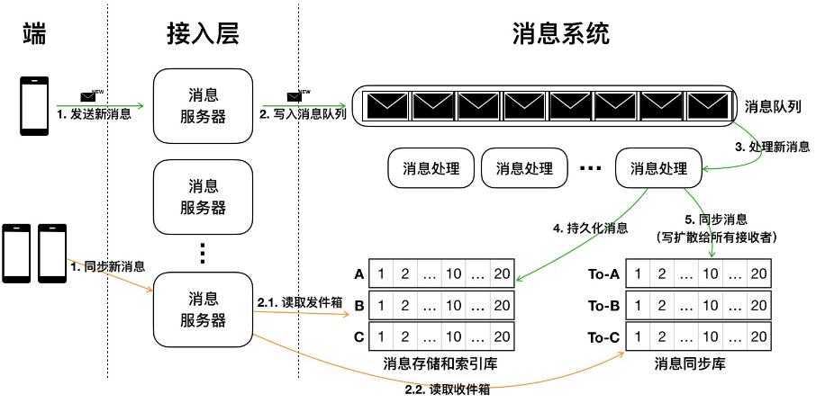

# IM（即时通讯系统）设计

主要组件：

- 客户端：web、小程序。
- 消息服务器：golang 实现的消息微服务。
- 消息队列：nats server。
- 存储库：golang + pg 实现的消息存储库，用于存储发件箱、持久化。
- 同步库：golang + (redis 或 nats) + pg 实现的消息同步队列，用于存储收件箱，写扩散给所有接受者。

## 功能模块

消息存储，消息系统中，消息存储是最基本的功能：

- 消息持久化、保证不丢失
- 快速高效的查询

## 存储库

### 会话窗口消息展示

- 存储库是聊天会话消息所对应的存储表，消息以会话分类存储，每个会话是一个消息队列。
- 消息队列通过 会话 ID 聚合。
- 消息按照自增序列号（sequenceId）有序排列
- 消息支持多种类型：图片、文件、文本等。

### 全文检索功能

- 需要对群 ID、消息发送人、消息类型、消息内容、以及时间建立索引
- 更细致的，其中消息内容需要使用分词字符串类型，从而提供模糊查询的能力。

## 同步库

### 新消息即时统计

- 每个会话维持一个消息未读数，也会有一个总未读数。此类数据需要客户端和服务端都持久化，这些未读数指的就是同步库拉取并统计过，但是还未被用户点开查看的数量。
  - 多客户端登录的未读消息数保持一致。
  - 如果多客户端各自维护未读数状态：
    - 服务端未读数过期机制，不会对一个客户端的未读数做永久持久化、否则：脏数据、资源浪费
  - 如果多客户端同步未读数状态：
    - 同客户端是否支持多处登录？涉及到长连接 map 维护的 key 定义问题，以及登录踢下线的机制。
    - 同步未读数的机制。

### 异步写扩散

是指同步库写扩散不需要等待存储库持久化的同步信号。通过消息队列实现。

### 新消息通知

- 站内：

  - 当客户端在线时，应用的系统服务会维护客户端的长连接，因而可以感知客户端在线。
  - 当用户的同步库有新消息写入时（即有新消息），应用会通过 WebSocket 发出信号通知客户端有新消息。然后由客户端拉取 客户端最新 sequenceId 之后的同步消息。
  - 消息到达 ACK: 新消息到达客户端，通过 WebSocket 应答，否则服务端等待超时后再次发出同步信号。以确保消息到达即时可靠。

- 站外：
  - 主要针对 APP，目前没有 APP 先不用考虑，以后有则需要结合 手机产商提供的操作系统级推送、APNS（IOS）、华为、小米、友盟等。
  - 邮箱推送
  - 短信推送

### 离线消息拉取

与 新消息通知到达后 拉取同步库消息流程一样，客户端带上本地最新消息 sequenceId 拉取。

## 表格设计

### 消息表

|      字段       |  类型  |                     说明                      |
| :-------------: | :----: | :-------------------------------------------: |
|   sequence_id   |  主键  |                     自增                      |
| conversation_id | string | 会话 Id，可以是用群 id 或者单聊用户的 id 组合 |
|    send_from    | string |                   发送人 Id                   |
|     send_to     | string |   接受者 Id，可能是某个用户，也可能是一个群   |
|   created_at    |  int   |                   发送时间                    |
|     content     |  text  |                   消息内容                    |
|  content_type   |  enum  | 消息类型：纯文本、富文本、图片、文件、视频等  |

其余相关字段后续结合需要补充

### 同步消息表

字段设计应该与消息表基本一致，不同之处在于持久化有过期时间，可能采用 redis 或者 nats2.0 的持久化特性实现。

### 会话表

|      字段       |     类型      |                        说明                        |
| :-------------: | :-----------: | :------------------------------------------------: |
|       id        |     主键      |                      会话 Id                       |
|      name       |    string     |                      会话名称                      |
| last_message_id |     外键      |                  最新一条消息 Id                   |
|      type       |     enum      |               会话类型：GROUP/SINGLE               |
|      users      | array[string] |              单聊用户 Id，为二元数组               |
|   created_at    |     time      |                    会话创建时间                    |
|   updated_at    |     time      | 会话更新时间、标识最近一次会话的发生时间，用于排序 |

### 好友关系表

|       字段        |  类型  |      说明       |
| :---------------: | :----: | :-------------: |
|     main_user     |  外键  | 第一人称用户 Id |
|     sub_user      |  外键  |     好友 Id     |
|     nickname      | string | 好友的昵称/备注 |
|    created_at     |  time  |  建立关系时间   |
| conversation_show |  bool  |  会话是否显示   |
|    undisturbed    |  bool  |   会话免打扰    |

好友关系一旦建立就会创建会话记录，无论客户端是否显示。

### 群聊关系表

|       字段        |  类型  |                 说明                 |
| :---------------: | :----: | :----------------------------------: |
|     main_user     |  外键  |           第一人称用户 Id            |
|  conversation_id  |  外键  | type 为 GROUP 的会话 id，也即群聊 Id |
|    created_at     |  time  |  群聊关系建立时间，也即加入群聊时间  |
|     nickname      | string |               群内昵称               |
| conversation_show |  bool  |             会话是否显示             |
|    undisturbed    |  bool  |              会话免打扰              |

## 欢迎补充
