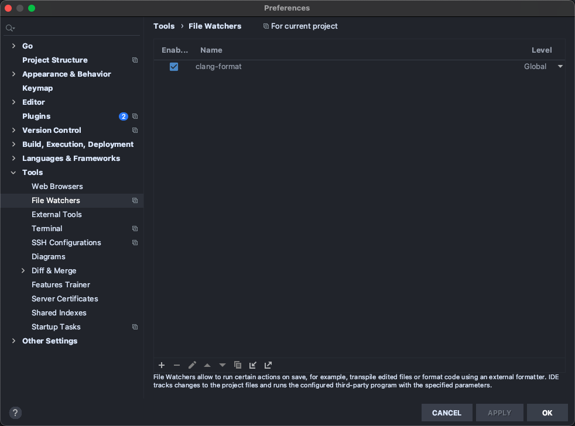
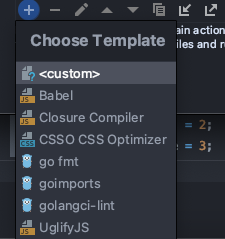
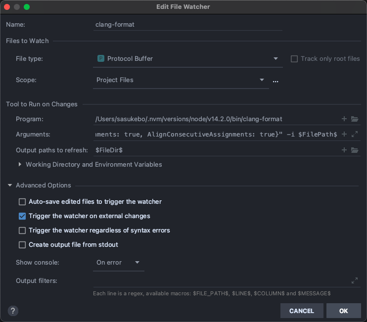

# 在 Goland 编辑器上配置 protobuf 文件的格式化工具

> 本教程教你如何在 Goland 中配置 clang-format 来格式化 protobuf 文件，以达到标准化格式的目的

## 安装 clang-format

这里使用的[clang-format](https://github.com/angular/clang-format)是 github 上使用 node 包装的原生 clang-format 工具，可以使用 npm 一键安装：

```sh
npm install -g clang-format
```

安装完毕后调用命令`clang-format -h`来检查是否安装成功。

## 配置

- 打开 goland 的 preference，Mac 使用 `cmd+,`.
- `Tools` -> `File Watchers`
  

- 点击`+`来添加一个 watcher，选择 `custom`
  

- 填写配置
  

  - 将文件类型选择为`Protocol Buffer`。
  - 范围选择为项目文件。
  - Program 指定你的 clang-format 二进制可执行文件位置。
  - 工具执行参数：

  ```
  -style="{BasedOnStyle: Google, IndentWidth: 4, ColumnLimit: 0, AlignConsecutiveAssignments: true, AlignConsecutiveAssignments: true}" -i $FilePath$
  ```

  - 输出地址填入参数`$FilePath$`
  - 高级选项：可以将`Auto-save edited files to trigger the watcher`取消勾选，否则会过于频繁的自动保存并格式化文件，影响我们的输入操作

## 最后

配置完成后，保存proto文件会触发自动格式化。
