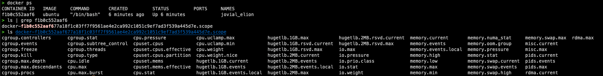

# 容器技术概念入门

## Linux namespace

举例来说，pid namespace 技术是专门针对进程 id 进行隔离的功能。
通过 pid namespace 可以将容器中的进程进行隔离，在容器内，进程 id 是重新计算的，比如

```sh
docker run --rm --it busybox /bin/sh
```

启动 docker 容器并在内部运行一个/bin/sh 进程，这对于容器而言是第一个进程，对于宿主机则不是。

除了`pid namespace`，linux 内核还支持`Mount/UTS/IPC/Network/User`这些 namespace，可被容器技术用于隔离这些资源信息。

docker 实际上就是在创建容器进程时，指定了这个进程所需启动的一组 Namespace 参数。

## 隔离与限制

虚拟化会带来额外的开销，而容器技术的进程实际还是运行在宿主机上。

但，单凭 Namespace 的隔离是不够彻底的。
而且，有很多资源和对象是不能被 Namespace 化的，比如时间。

`Linux Cgroups`就是 linux 内核中用来为进程设置资源限制的重要功能，它最主要的功能就是限制一个进程组能够使用的资源上限，包括 CPU、内存、磁盘和网络带宽等。

`docker run`启动一个容器的时候会在`/sys/fs/cgroup`的某一目录下为该容器创建一个目录，并通过配置文件来告诉 cgroup 如何限制这个容器进程组的资源。

```sh
$ docker ps
#=> CONTAINER ID
#=> f1b0c552aaf6

# Ubuntu 22.04 LTS
$ ls /sys/fs/cgroup/system.slice | grep f1b0c552aaf6
#=> docker-f1b0c552aaf6.scope
```



