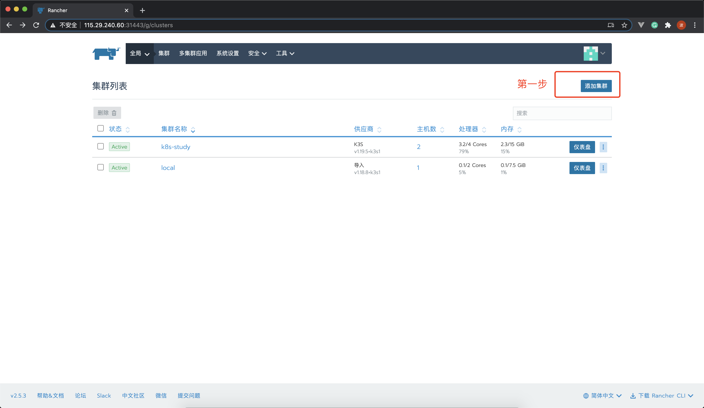
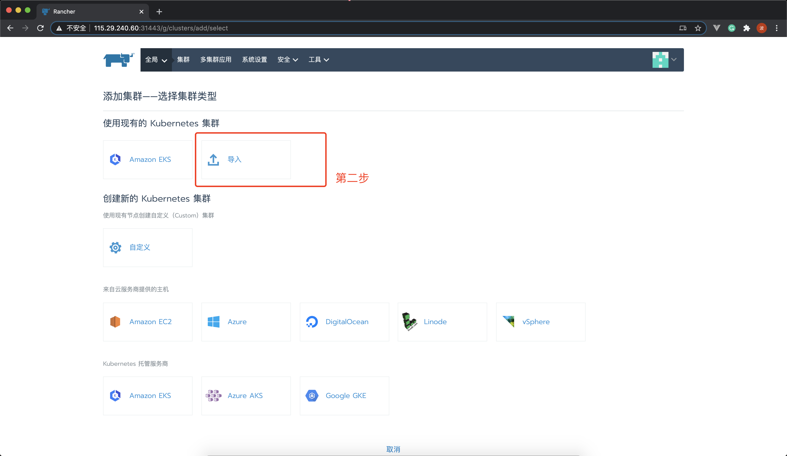
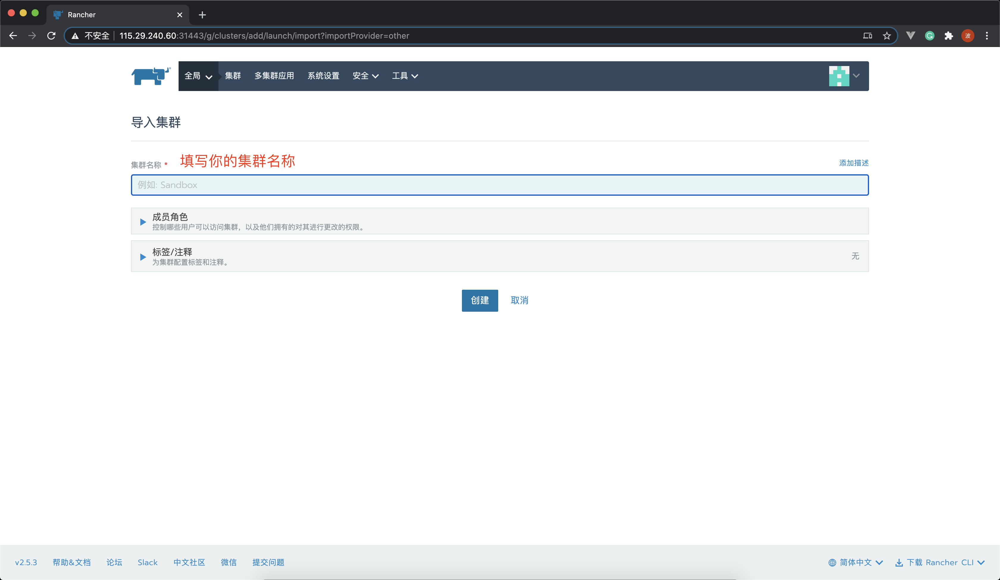
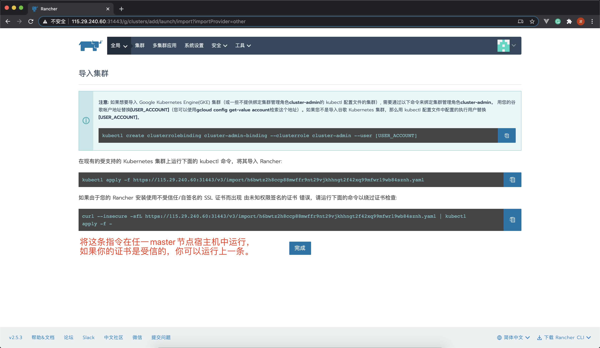
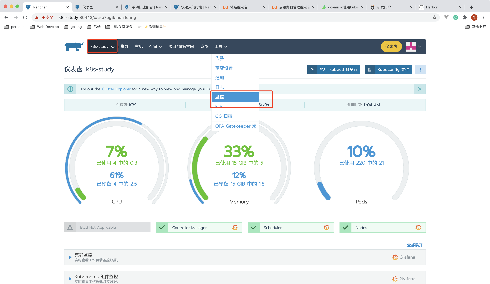
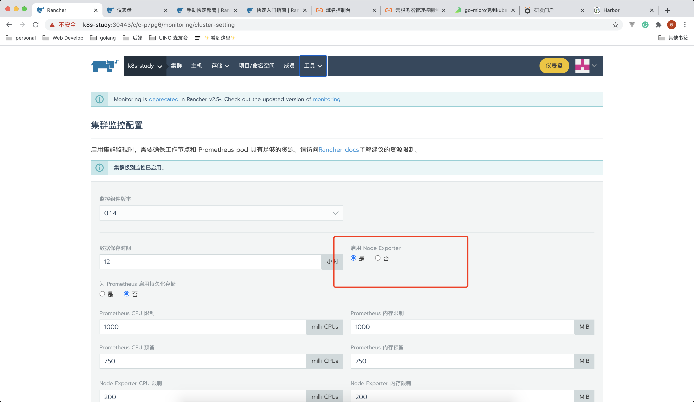
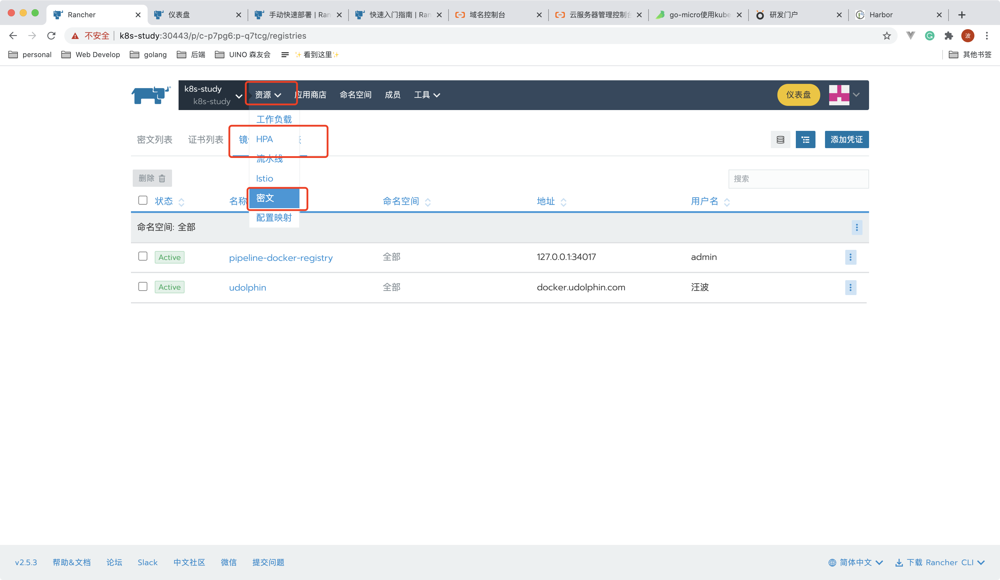
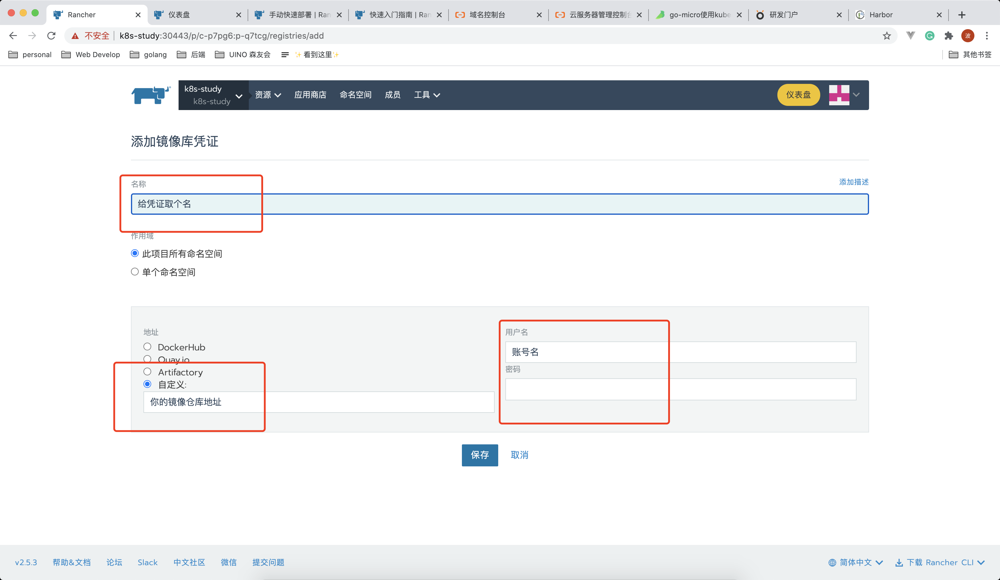
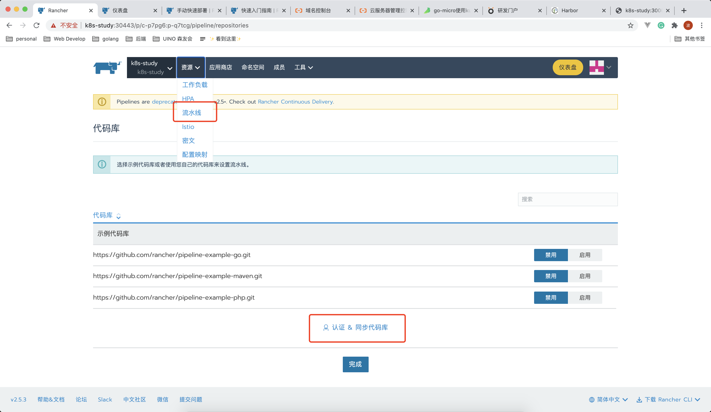
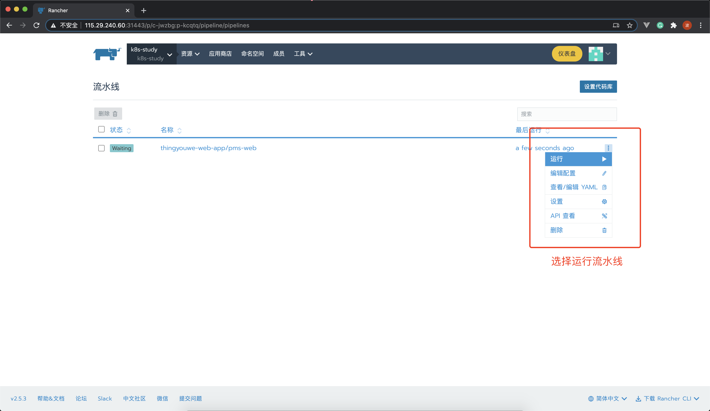

# 使用 Rancher 管理 k8s 集群

[rancher 官网](https://docs.rancher.cn/) | [rancher2 文档](https://docs.rancher.cn/rancher2/)

## 将集群加入到 rancher

在我们使用 rancher 管理我们的 k8s 集群之前，需要先将集群加入到 rancher 中。





执行完指令后，可以去 rancher 全局界面查看集群的加入状态，这一般需要等待一段时间，等待中状态为`pending`，成功后显示为`Active`。

## 启用集群监控功能



- 选择你的集群
- 在菜单栏工具中点击监控
  
- 选择启用 Node Exporter
- 最后点击保存

此操作过后，监控功能并不能马上生效，因为 k8s 会去 docker 公共镜像仓库拉取相关的镜像文件，然后部署必要的服务，请耐心等待并检查日志，确认是否有错误发生。

## 配置 CI

[什么是 CI](https://www.ruanyifeng.com/blog/2015/09/continuous-integration.html)

### 配置私有的镜像仓库

实际生产中，一般会搭建企业私有的镜像仓库，我们需要为 rancher 配置好镜像仓库的访问权限，这样才能让它自动化的上传和下载镜像文件。

### 配置密文

在菜单栏集群中选中你的项目，如果没有，你也可以先新建一个自己的项目。
然后在菜单栏资源中，选择密文，然后在 tab 中选择`镜像库凭证列表`，点击配置凭证。


为你的镜像库凭证命名，地址选择自定义，填入镜像库的地址，并填写登录镜像库的账号密码。

### 认证和同步代码仓库


前往配置代码仓库，这里需要前往你的代码仓库开放应用权限，提供认证账号和密码。
可以参考[官方文档](https://docs.rancher.cn/docs/rancher2/k8s-in-rancher/pipelines/_index#gitlab)。

完成认证后，你就可以看到代码库中所有你的项目，选择启用则会创建流水线对象。


**注意**流水线运行过程可能会失败，是因为项目的`deployment.yaml`文件中需要指定部署 Deployment 对象的服务账号：

```yaml
apiVersion: apps/v1
kind: Deployment
metadata:
  name: your-app
  namespace: your-namespace
  labels:
    app: your-app
spec:
  replicas: 1
  selector:
    matchLabels:
      app: your-app
  template:
    metadata:
      labels:
        app: your-app
    spec:
      serviceAccountName: micro-services
      imagePullSecrets:
        - name: pipeline-bj-registry
      containers:
        - name: your-app
          image: ${CICD_IMAGE}:${CICD_GIT_COMMIT}
          ports:
            - containerPort: 8001
```

其中`spec:serviceAccountName:micro-services`指定了账号为`micro-services`，我们需要预先创建该账号并且分配权限：

```yaml
# 创建账号
apiVersion: v1
kind: ServiceAccount
metadata:
  name: micro-services
---
# 创建角色
apiVersion: rbac.authorization.k8s.io/v1
kind: ClusterRole
metadata:
  name: micro-registry
rules:
  - apiGroups:
      - ''
    resources:
      - pods
    verbs:
      - list
      - patch
      - watch
---
# 创建角色绑定
apiVersion: rbac.authorization.k8s.io/v1
kind: RoleBinding
metadata:
  name: micro-registry
roleRef:
  apiGroup: rbac.authorization.k8s.io
  kind: ClusterRole
  name: micro-registry
subjects:
  - kind: ServiceAccount
    name: micro-services
    namespace: default
```

你可以通过在 rancher 的工作负载中导入 yaml，导入模式为项目，选中正确的命名空间，也可以通过在 master 节点宿主机上执行下面命令：

```shell
kubectl apply --namespace=your_name_space ./rbac.yaml
```

这一操作实际上是创建了三个 k8s 对象，分别为`ServiceAccount`、`ClusterRole`和`RoleBinding`。

**Tips**

- [配置k3s内container加速镜像地址](https://blog.csdn.net/PlatoWG/article/details/107811162)

---

_最后编辑于 2020 年 12 月 17 日 20:31:01_

[返回目录](./menu.md)
