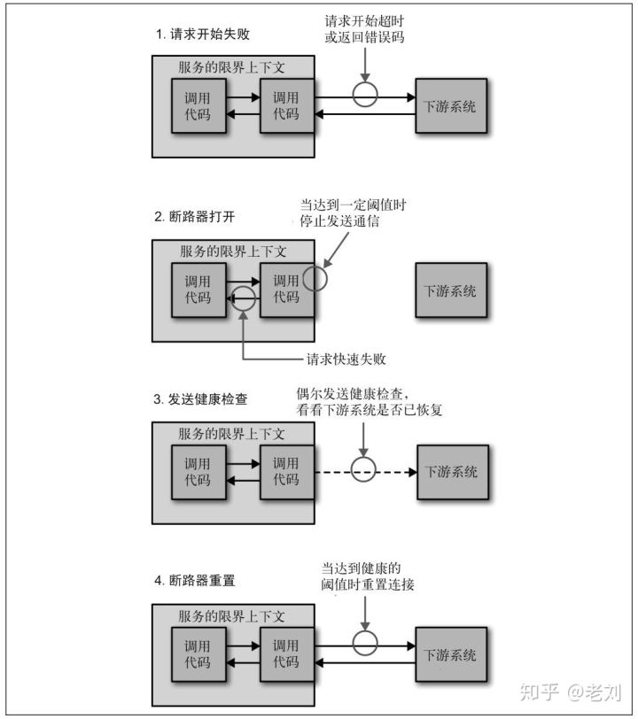

# 微服务架构

[参考文章](https://www.zhihu.com/question/65502802)

## 最初的需求

单体应用，将所有的业务逻辑汇集在一个项目中，随着时代及业务的发展，不能满足需求。

多终端应用的开发，许多业务逻辑重复

将公共服务抽象出来，产生专门的服务，以供各个组件调用

数据库拆分，服务各自管理自己的数据库，针对特殊的业务采用对应的持久化层、缓存机制等。

微服务架构的故障定位有一定难度，没有特殊的监管机制，需要花费大量的时间定位故障点。一个故障的产生可能会造成整个系统的故障，雪崩效应。

应对故障一般从两方面入手：

- 尽量减少故障发生概率：事前监控、时候分析
- 降低故障造成的影响：容错、服务降级

## 故障监控

微服务架构中组件繁多，各个组件需要监控的指标不同，比如 redis 缓存一般监控占用内存值、网络流量，数据库监控连接数量，磁盘空间。
业务服务监控并发数量、响应延迟错误率等。

一般都做法是让各个组件提供报告自己状态的接口（metrics 接口），这个接口输出的数据格式应该是一致的。然后部署一个指标采集器组件，
定时从这些接口获取并保持组件状态，同时提供查询服务。最后还需要一个 UI，从指标采集器查询各项指标，绘制监控界面，或者根据阈值发出告警。

大部分组件不需要自己动手开发 metrics 接口，一般有开源组件，例如 RedisExporter 和 MySQLExporter。
微服务则更具各个服务的业务逻辑实现自定义的指标接口。

## 定位故障，链路跟踪

微服务框架下，一个用户的请求往往涉及多个内部服务调用，为了方便定位问题，需要能够记录每个用户请求时，微服务内部产生了多少微服务调用，
及其调用关系。这个叫做链路跟踪。

要实现链路跟踪，每次服务调用会在 HTTP 的 HEADERS 中记录至少四项数据：

- traceID 标识一个用户请求的调用链路。具有相同 traceID 的调用属于一条链路。
- spanID 标识一次服务调用的 ID，即链路跟踪的节点 ID。
- parentID 父节点的 spanID
- requestTime & responseTime 请求时间和响应时间。

另外还需要调用日志收集与存储的组件，以及展示链路调用的 UI 组件。

HTTP 请求拦截器，在每次 HTTP 请求时生成这些跟踪数据注入到 HEADERS 中，同时记录日志。（Dapper 的开源实现 Zipkin）。
HTTP 请求的拦截器可以在微服务的代码中实现，也可以使用一个网络代理组件来实现。

链路追踪只能定位到是哪个服务出现了问题，不能提供具体的错误信息，查找具体的错误信息的能力则需要日志分析组件来提供。

## 分析故障，日志分析

服务器规模增多时，日志文件的大小会膨胀到难以用文本编辑器进行访问，更糟的是，它们分散在多台服务器上面。
排查一个问题，需要登录到各台服务器上获取日志文件。

当应用规模变大的时候，需要一个日志的搜索引擎。
大名鼎鼎的 ELK 日志分析组件。
ELK 是 Elasticsearch、Logstash 和 Kibana 三个组件的缩写。

- Elasticsearch 搜索引擎，同时也是日志的存储
- Logstash 日志采集器，它接收日志的输入，对日志进行一些预处理，然后输出到 Elasticsearch。可以在日志产生时调用 Loastash 的接口将日志
  发送过去，或者在每个服务里再部署个 Agent 扫描日志文件然后输出给 Logstash。
- Kibana UI 组件，通过 Elasticsearch 的 API 查找数据并展示给用户。

## 网关-权限管理，服务治理

随着微服务的增多，如果不管理调用关系，将会显得乱糟糟的。
微服务调用需要一个把关的东西，也就是网关。
网关可以：

- 每次进行服务调用时进行权限校验
- 另外网关可以作为一个提供服务接口文档的平台。

## 服务注册与发现

前面的组件，旨在降低故障发生的可能性，然而故障总是会发生的，所以另一个需要研究的是，如何降低故障产生的影响。（容错性）

- 冗余
  最粗暴的策略是冗余，一个服务部署多个实例，一是分担压力，二是即使挂了一个实例，还有其他实例顶着。
  冗余数量视时期而定，一般时间段实例数较少，节假日促销等特殊时期实例数需要更多来支撑服务。

  将实例注册到负载均衡或 DNS 上。

  解决服务注册的手段，可以部署一个服务发现，

- 服务发现
  提供所有已注册服务的地址信息的服务。
  定期检查应用服务的健康状态，去掉不健康的实例地址。

  DNS 也算是一种服务发现服务。

  各个应用服务在启动时自动将自己注册到“服务发现”服务上，并且启动后会实时从服务发现服务器同步各个应用服务的地址列表到本地。

## 熔断、服务降级、限流

1. 熔断
   当一个服务停止响应时，调用方通常会等待一段时间，然后超时或者受到错误返回。
   如果调用链路比较长，可能会导致请求堆积，整条链路占用大量资源一直等待下游响应。
   所以当多次访问一个服务失败时，应该采用熔断策略

2. 服务降级

当下游服务停止工作后，如果该服务并非核心业务，则上有服务应该降级，以保证核心业务不中断。
比如超市下单界面有一个推荐商品凑单的功能，当推荐模块挂了以后，下单功能不应该一起挂掉，只需要暂时关闭推荐功能即可。

3. 限流

一个服务挂掉后，上游服务或者用户一般会习惯性的重试访问，这导致一旦服务恢复正常，很可能因为瞬间的网络流量过大又立刻挂掉，因此服务需要自我保护，限制流量。

限流策略有很多：

- 单位时间内接收一定数量的请求，其余丢弃。
- 仅仅拒绝产生大量请求的服务发出的请求。

## 测试

微服务架构下，测试分为三个层次：

- 端到端测试（终端到服务端），覆盖整个系统，一般在用户界面机型测试。
- 服务测试，针对服务接口进行测试。（集成测试）
- 单元测试，针对代码单元进行测试。（单元测试）

实现难度递减

一般只对核心功能做端到端测试，一旦测出问题，则分解到单元测试分析失败原因，编写单元测试重现问题。

## 总结

- 指标接口
- 链路跟踪注入
- 日志引流
- 服务注册发现
- 路由规则
- 熔断、限流、服务降级等功能
